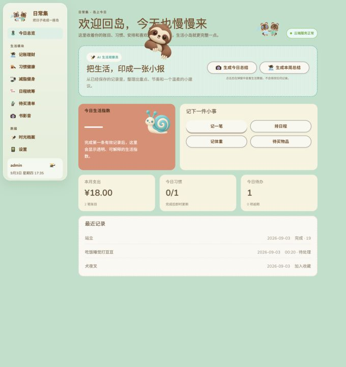

# 日常集 · 生活工作台

个人生活记录工作台的一期 Web 工程。产品以“今日总览”和“时光档案”为双聚合入口，覆盖财务、习惯、健身、日程、待买和书影音六类记录。

## 平台预览

“日常集”把分散的生活记录收进同一个工作台：在今日总览快速查看支出、习惯、待办和最近动态，也可以分别管理记账理财、习惯健康、减脂健身、日程统筹、待买清单与书影音记录，所有内容会统一沉淀到时光档案。



## 工程边界

```text
apps/web       React + Vite 在线客户端
apps/server    Fastify JSON API（正式数据的唯一入口）
packages/shared  前后端共享 DTO、Zod Schema 与纯类型
```

- 正式业务数据只保存在服务端 SQLite，不在浏览器维护业务副本。
- Web 只依赖有版本的 API 合约，不了解 Drizzle 表结构。
- Server Route 负责 HTTP 边界；业务编排、领域计算、Repository 与 AI 适配分别隔离。
- 二期 Tauri 复用 Web 页面与 API Client，仍访问同一套服务端 API。

## 开始开发

需要 Bun 1.3 或更新版本。

```bash
bun install
cp .env.example .env
bun run --cwd apps/server db:migrate
ADMIN_USERNAME=owner ADMIN_PASSWORD='请替换为至少8位的强密码' bun run --cwd apps/server admin:init
bun run dev
```

默认地址：Web `http://localhost:5173`，API `http://localhost:8787`。Vite 会把 `/api` 请求代理给本地 API。

也可以打开两个终端，分别启动前后端：

```bash
# 终端 1：启动后端 API
bun run dev:server

# 终端 2：启动前端 Web
bun run dev:web
```

`admin:init` 只允许在空数据库中执行一次。密码使用 Argon2id 保存；命令不会把明文写入数据库或配置文件。正式部署前请替换 `.env` 中的 `SESSION_SECRET`，并确保数据目录位于持久化磁盘。

如果首次初始化时填错了凭据，可以在本机重置唯一管理员。重置会立即撤销已有登录会话：

```bash
ADMIN_USERNAME=新的用户名 ADMIN_PASSWORD='新的强密码' bun run --cwd apps/server admin:reset
```

常用命令：

```bash
bun run lint
bun run typecheck
bun run test
bun run build
bun run check
```

## 当前阶段

仓库已完成 Web 一期核心模块的首轮纵向切片：单管理员登录、财务、习惯健康、减脂健身、日程统筹、待买清单、书影音，以及汇聚上述记录的时光档案。每个模块均已贯通共享数据合约、服务端 Repository、鉴权 API、Web 数据层和 Animal Island 风格页面；今日总览会同步展示财务、习惯、待办和最近生活记录。

财务数据采用以下约束：金额以整数“分”存储；新增账目由客户端生成 UUID，可安全重试；更新与删除通过 `expectedUpdatedAt` 做乐观并发校验；删除采用软删除。

当前属于可操作的 MVP：六类记录的创建、编辑、状态流转、核心统计和跨模块时间线已可用。财务及五类生活记录均支持带确认的软删除，并可在设置页“最近删除”中恢复；编辑、恢复和删除都带并发冲突保护。日程支持到时、提前 10/30/60 分钟或提前 1 天的应用内提醒。书影音支持封面上传、压缩、预览、替换与移除。设置页支持带六类可读工作表、版本、实体计数和 SHA-256 校验的业务全量 Excel 导出、恢复预检及事务恢复。系统级通知仍在后续阶段。

总览通过单一聚合接口读取财务、习惯、待办和最近记录，避免模块请求瀑布；时光档案使用不透明游标分页，每次按需加载 20 条较早记录。

阶段交接和后续任务统一记录在 [`handoff.md`](./handoff.md)。

后续开发与代码审查统一遵循 [`docs/编码规范.md`](./docs/编码规范.md)；Fastify 服务端还必须遵循 [`docs/Fastify后端编码规范.md`](./docs/Fastify后端编码规范.md)。代码代理的强制执行规则位于 [`AGENTS.md`](./AGENTS.md)。
